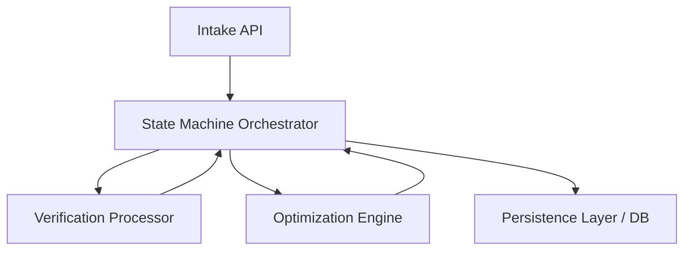

# PHASE 2 OBJECTIVE

The objective of Phase 2 is to construct the Core Business Logic & Orchestration Integration layers on top of the verified Phase 1 Persistence Layer. This entails implementing a deterministic State Machine Orchestrator, Verification Processor, and Optimization Engine. The system must orchestrate complex multi-stage pipelines through strict mathematical ceilings, cyclic recovery algorithms, and cryptographically verified artifacts without modifying the underlying, authoritative PostgreSQL schema and Alembic migrations.

# PHASE 2 SUCCESS CRITERIA

1. **Absolute Determinism:** Any two identical payloads must mathematically produce the exact same final database state.
2. **State Machine Integrity:** The Orchestrator perfectly models the defined DAG (Directed Acyclic Graph), properly bounding transitions, particularly resolving the `NEARLY_READY` cyclic recovery loop and `PENDING_REPROMPT` loops.
3. **Cryptographic Validation:** The Verification Processor flawlessly calculates and strictly enforces tamper-evident physical assessments using SHA-256 hashing.
4. **Mathematical Policy Bounding:** Optimization enforces all limits defined in ADR-024 (e.g., `SYSTEM_BASE_INTEREST_RATE`, `SYSTEM_MAX_TENURE`).
5. **Zero Schema Drift:** Implementations must not force changes to existing ORM models or database migrations. Phase 1 tests must remain passing.

# IN SCOPE

* State Machine Orchestrator logic and state transition tracking.
* Verification Processor implementation (Tamper evidence, cryptographic hashing,AA checks, reprompt logic).
* Optimization Engine implementation (Cyclic Recovery loops, Affordability Index, Co-Applicant reverse algebra).
* Integration of the deterministic constants, registries (Pincode, Divisibility), and date-diff normalization.
* Core API endpoint integration for specific state transitions (e.g., `/api/v2/counter_offer_response`, `/api/v2/reprompt_submission`).

# OUT OF SCOPE

* Redesigning or modifying the authoritative PostgreSQL schema.
* Altering Alembic migration scripts.
* Modification of existing ORM models (unless required to fix a proven defect).
* Implementation of Deep Learning or LLM-based Decision Making.
* Real-Time Bureau Integration and Dynamic Recommendation Generation.
* Generating Regulatory Adverse Action Notices.
* Creating or altering frontend interfaces.

# DEPENDENCY GRAPH

# STATE MACHINE DESIGN

**Component Overview**
* **Inputs:** Application session ID, incoming API payloads, output signals from Verification/Optimization processors.
* **Outputs:** Mutated Application Session state, State Transition Events (Audit Ledger).
* **Invariants:** State transitions must strictly follow the defined graph. Events must be immutable and append-only.
* **Failure states:** Invalid state transition attempt results in immediate HTTP 400 rejection; state remains unchanged.

### Explicit State Transitions

1. **`INTAKE` -> `TRIAGE`**
   * **Trigger:** New application payload ingested.
   * **Preconditions:** Valid minimum payload present.
   * **Side effects:** Session and Applicant profiles created in DB.
   * **Audit requirements:** Log intake creation event.

2. **`TRIAGE` -> `PENDING_VERIFICATION`**
   * **Trigger:** Initial triage bounds evaluated.
   * **Preconditions:** Applicant passes initial eligibility ceilings.
   * **Side effects:** Trigger baseline verification requirements.
   * **Audit requirements:** Log triage rules and status.

3. **`PENDING_VERIFICATION` -> `PENDING_REPROMPT`**
   * **Trigger:** `MISSING_SECONDARY_CONTACT` detected by Verification layer.
   * **Preconditions:** Verification payload misses secondary contact.
   * **Side effects:** Optimization remains strictly frozen.
   * **Audit requirements:** Log missing field and reprompt API issuance.

4. **`PENDING_REPROMPT` -> `PENDING_VERIFICATION`**
   * **Trigger:** `reprompt_submission_received` via API.
   * **Preconditions:** Corrected payload provides secondary contact.
   * **Side effects:** Verification layer structurally re-evaluates the artifact.
   * **Audit requirements:** Log corrected payload acceptance.

5. **`PENDING_REPROMPT` -> `NOT_READY_YET`**
   * **Trigger:** `reprompt_timeout_expired`.
   * **Preconditions:** Timeout elapsed without valid payload.
   * **Side effects:** Terminal rejection; application closed.
   * **Audit requirements:** Log TTL expiration and terminal failure.

6. **`PENDING_VERIFICATION` -> `VERIFIED`**
   * **Trigger:** Successful verification of all artifacts.
   * **Preconditions:** `tamper_evidence_pass` == True AND `co_app_canonical_verification_pass` == True.
   * **Side effects:** Verification baseline frozen.
   * **Audit requirements:** Log cryptographic hash matches and verification boolean passes.

7. **`VERIFIED` -> `OPTIMIZATION`**
   * **Trigger:** State freeze completes.
   * **Preconditions:** Valid Verification baseline exists.
   * **Side effects:** Invoke Optimization Engine evaluation.
   * **Audit requirements:** Log Optimization start timestamp.

8. **`OPTIMIZATION` -> `READY`**
   * **Trigger:** Mathematical affordability succeeds natively.
   * **Preconditions:** `EMI` <= `Affordability Limit`.
   * **Side effects:** Final contract terms generated and sealed.
   * **Audit requirements:** Log deterministic parameters used.

9. **`OPTIMIZATION` -> `NEARLY_READY`**
   * **Trigger:** Fallback condition engaged (Stretching or Co-Applicant needed).
   * **Preconditions:** Baseline fails but mathematically recoverable via stretch or co-applicant.
   * **Side effects:** Generates counter-offer and calculates `required_coapplicant_income_baseline`.
   * **Audit requirements:** Log fallback algebra and counter-offer parameters.

10. **`OPTIMIZATION` -> `NOT_READY_YET`**
    * **Trigger:** Terminal policy breach, Fraud detected, or fundamental unaffordability.
    * **Preconditions:** No mathematical path to recovery.
    * **Side effects:** Application immediately rejected.
    * **Audit requirements:** Log exact failure bound (e.g., LTI breach).

11. **`NEARLY_READY` -> `PENDING_VERIFICATION`**
    * **Trigger:** `user_submits_coapplicant` via Dual-Track schema.
    * **Preconditions:** Co-Applicant details strictly appended.
    * **Side effects:** Verification loops to evaluate Co-Applicant. Primary baseline remains frozen.
    * **Audit requirements:** Log Co-Applicant submission ingestion.

12. **`NEARLY_READY` -> `READY`**
    * **Trigger:** `user_accepts_counter_offer`.
    * **Preconditions:** Explicit API ingestion of acceptance.
    * **Side effects:** Contract terms mathematically sealed.
    * **Audit requirements:** Log borrower's exact acceptance payload.

13. **`NEARLY_READY` -> `NOT_READY_YET`**
    * **Trigger:** `user_rejects_counter_offer` OR `counter_offer_expired`.
    * **Preconditions:** Explicit rejection API call or TTL expiration.
    * **Side effects:** Terminal failure lock.
    * **Audit requirements:** Log specific reason for termination (reject vs timeout).

# VERIFICATION PROCESSOR DESIGN

* **Inputs:** Verification payloads, FO visit photos, vintage artifacts, Co-Applicant pathways.
* **Outputs:** Validation flags: `tamper_evidence_pass` (Boolean), `co_app_canonical_verification_pass` (Boolean).
* **Invariants:** Must utilize SHA-256 for physical artifact hashing. MUST yield `tamper_evidence_pass = False` for ANY mismatch.
* **Failure states:** If tamper evidence fails, transition triggers immediate terminal `NOT_READY_YET`. If missing contact, triggers `PENDING_REPROMPT`.

# OPTIMIZATION ENGINE DESIGN

* **Inputs:** Verified Applicant Data, Co-Applicant Data, System Constants (`SYSTEM_BASE_INTEREST_RATE`, `SYSTEM_MAX_TENURE`, etc.), Pincode mapping, Divisibility Registry.
* **Outputs:** Sealed terms (Principal, EMI, Tenure) OR Counter-Offer limits OR `required_coapplicant_income_baseline`.
* **Invariants:** 
    * `SYSTEM_MAX_TENURE` and `SYSTEM_MAX_LOAN_AMOUNT` cannot be exceeded.
    * `business_vintage_months` calculation uses strict month-level truncation.
    * Must use exact reverse algebra for `required_coapplicant_income_baseline`.
* **Failure states:** If maximum stretching fails and Co-Applicant reverse algebra exceeds possible capacity, Engine returns `Unaffordable` resulting in `NOT_READY_YET` or `NEARLY_READY` based on divisibility.

# REQUIRED DOMAIN MODELS

1. **ApplicationSession:** Tracks current state and orchestrates root operations.
   * *Inputs:* Applicant ID, Requested Loan Amount. *Outputs:* Current state, timestamps. *Invariants:* `updated_at` must track changes.
2. **ApplicantProfile:** Holds primary and co-applicant data with strict overlap discrimination.
   * *Inputs:* Income, Pincode. *Outputs:* Profiles bounded by role. *Invariants:* Role switching requires explicit row recreation.
3. **VerificationRecord:** Tamper-evident repository for physical and API verifications.
   * *Inputs:* Cryptographic hashes, AA status. *Outputs:* Integrity validation signals. *Invariants:* Append-only design.
4. **OptimizationResult:** Stores immutable records of Affordability runs.
   * *Inputs:* Affordability score, calculated EMIs. *Outputs:* Counter-offers, Baselines. *Invariants:* Tied exactly to one state progression.
5. **StateTransitionEvent:** The append-only audit ledger.
   * *Inputs:* Previous State, Next State, Trigger. *Outputs:* Provable history. *Invariants:* Immutable via raw PostgreSQL trigger.

# REQUIRED SERVICES

1. **StateMachineOrchestratorService:** Manages DAG transitions, enforcing boundaries and writing to `state_transition_events`.
   * *Inputs/Outputs/Invariants:* Described under State Machine Design.
2. **VerificationProcessorService:** Handles AA evaluations, Reprompt evaluation, and executes SHA-256 integrity validation.
   * *Inputs/Outputs/Invariants:* Described under Verification Processor Design.
3. **OptimizationEngineService:** Performs PMT math, Co-Applicant capacity calculations, Pincode multiplier mappings, and stretch loop logic.
   * *Inputs/Outputs/Invariants:* Described under Optimization Engine Design.

# REQUIRED TESTS

* **Cryptographic Integrity Suite:** Tests SHA-256 matches and mismatches explicitly enforcing the fail-closed terminal reject.
* **Reprompt Loop Suite:** Validates `PENDING_REPROMPT` locking and successful resume to `PENDING_VERIFICATION` upon correct payload.
* **Constants & Registry Boundaries:** Fuzz tests ensuring `SYSTEM_MAX_TENURE`, `SYSTEM_MAX_LOAN_AMOUNT`, and `SYSTEM_BASE_INTEREST_RATE` limits hold absolutely.
* **Co-Applicant Salvage Accuracy:** Verifies the `required_coapplicant_income_baseline` reverse algebra outputs exact integer matches to manual math.
* **Recovery Loop Tests (ADR-023):** Ensures `NEARLY_READY` routing correctly funnels back to Verification or to `READY`/`NOT_READY_YET`.

# RISKS

1. **ORM Discrimination Integrity:** Dynamic switching of Applicant/Co-Applicant roles will corrupt SQLAlchemy's Identity Map. Must delete and recreate rows.
2. **PostgreSQL Trigger Drift:** `trg_set_updated_at` triggers won't auto-advance parent rows if only child records update.
3. **Enum Validation Constraints:** Modification to State Machine enums will not auto-sync via Alembic; manual schema management is strictly required if states change.

# IMPLEMENTATION ORDER

1. **System Constants & Registries (ADR-024):** Hardcode system constants, Pincode mappings, and Divisibility lookup tables.
2. **Verification Processor Implementation (ADR-025):** Build the Tamper-Evidence hashing and Co-Applicant validation formulas.
3. **Optimization Engine Core:** Implement affordability math, Date-Diff truncation, and Reverse Algebra (Co-Applicant salvage calculations).
4. **State Machine Orchestrator Core:** Build the directed graph rules engine and the API endpoints for specific state transitions.
5. **Recovery & Reprompt Hooks (ADR-023, ADR-025):** Connect `PENDING_REPROMPT` and `NEARLY_READY` cyclic routing explicitly to the orchestrator APIs.
6. **Integration & API Wiring:** Connect all endpoints to the DB Persistence Layer.

# STOP POINTS

* **STOP POINT 1:** After implementing Constants and Verification formulas. Run isolated unit tests on the cryptography before wiring the Orchestrator.
* **STOP POINT 2:** After Optimization Engine math is complete. Validate `required_coapplicant_income_baseline` algebra perfectly matches design spec mathematically before proceeding.
* **STOP POINT 3:** After State Machine Core mapping is implemented but BEFORE integration with persistence APIs, to guarantee the DAG restricts all invalid pathways.

---

**CONFIDENCE SCORE:** 98/100 (Architecture is perfectly defined, mathematically isolated, and strictly grounded in repository reality/ADR documentation. All critical paths and constraints are fully known).
