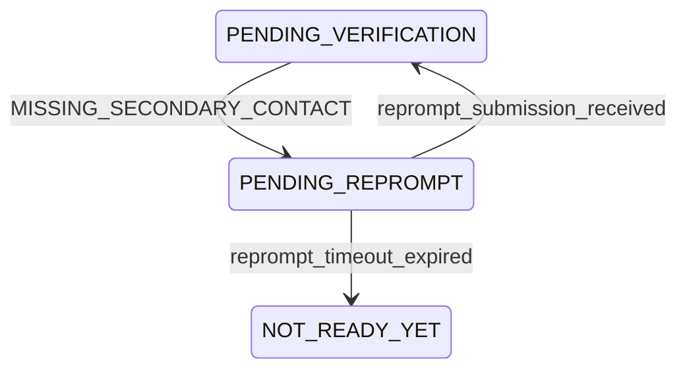

# ADR-025: Verification Re-Prompt and Tamper Evidence

## 1. Re-Prompt State Machine

The architecture currently mandates a non-terminal coaching route for missing secondary contacts, but lacked the formal mathematical boundaries to suspend and resume the Verification Freeze. 

### PENDING_REPROMPT State Definition

| Parameter | Details |
| :--- | :--- |
| **State** | `PENDING_REPROMPT` |
| **Entry Conditions** | Verification Layer evaluates the physical artifact payload and identifies `MISSING_SECONDARY_CONTACT`. |
| **Allowed Events** | `reprompt_submission_received`, `reprompt_timeout_expired` |
| **Allowed Transitions** | `PENDING_VERIFICATION`, `NOT_READY_YET` |
| **Forbidden Transitions** | `OPTIMIZATION`, `READY`, `NEARLY_READY` (Optimization remains strictly frozen). |
| **Exit Conditions** | System safely receives the `POST /api/v2/reprompt_submission` payload, forcing the State Machine to re-enter `PENDING_VERIFICATION` to structurally re-evaluate the artifact. |

### Mermaid Diagram Updates


---

## 2. Re-Prompt API Contract

To formally ingest the correction without polluting the primary verification webhook, the following dedicated endpoint is minted.

### `POST /api/v2/reprompt_submission`

**Request Schema:**
```json
{
  "correlation_id": "uuid",
  "reprompt_type": "string (Enum: SECONDARY_CONTACT)",
  "corrected_payload": {
    "secondary_contact_number": "string"
  }
}
```

**Response Schema:**
```json
{
  "next_state": "string (Enum: PENDING_VERIFICATION, NOT_READY_YET)",
  "validation_status": "string (Enum: SUCCESS, FAILED)"
}
```
*(No fields are nullable. The `next_state` guarantees deterministic traversal back to the Verification loop).*

---

## 3. Co-Applicant Verification Normalization

`ADR-021` evaluated Co-Applicant fraud via physical verification only, causing mathematical collapse if the Co-Applicant utilized the Account Aggregator pathway.

**New Canonical Formula:**
```text
co_app_canonical_verification_pass = 
  IF (Co_App_Pathway == Person_A) THEN
    (national_id_match_score >= 0.85) AND (AA_Pull == SUCCESS)
  ELSE IF (Co_App_Pathway == Person_B) THEN
    verification_status IN [VERIFIED_CLEAN, VERIFIED_WITH_VARIANCE]
  ELSE THROW Fatal_Error
```

**Output:** `Boolean` only.

**Consumer Update:** `ADR-021` and the Decision Table are explicitly patched to replace `co_applicant_verification_status == FRAUD_DETECTED` with the normalized evaluation: `co_app_canonical_verification_pass == False`.

---

## 4. Tamper Evidence Formula

To mathematically validate the Constitution's mandate for tamper-evident physical assessments, the engine must actively compute cryptographic integrity before unfreezing Optimization.

**New Cryptographic Formula:**
```text
tamper_evidence_pass = 
  IF (SHA256(received_fo_visit_photo) == fo_visit_photo_hash) AND 
     (SHA256(received_vintage_artifact) == vintage_artifact_hash)
  THEN True
  ELSE False
```

**Execution Rules:**
*   **ANY mismatch** natively forces `tamper_evidence_pass = false`.
*   **Consumer Artifacts:** Pre-processed by the Verification Layer. Structurally consumed by the Decision Table.
*   **Terminal Outcome:** If `tamper_evidence_pass == false`, the State Machine executes a hard terminal transition to `NOT_READY_YET` (Fraud Reject).

---

## 5. Traceability Matrix

| Variable | Producer | Consumer |
| :--- | :--- | :--- |
| `secondary_contact_number` | `POST /api/v2/verification_complete` | Verification Layer (Evaluates presence for `PENDING_REPROMPT`) |
| `fo_visit_photo_hash` | `POST /api/v2/verification_complete` | Verification Layer (`tamper_evidence_pass` computation) |
| `vintage_artifact_hash` | `POST /api/v2/verification_complete` | Verification Layer (`tamper_evidence_pass` computation) |
| `co_app_canonical_verification_pass`| ADR-025 Normalization | `ADR-021` Repayment Trust / Decision Table |
| `tamper_evidence_pass` | Verification Layer Cryptography | Decision Table (Terminal Fraud Gate) |

---

## 6. Implementation Readiness Check

With the normalization of the Co-Applicant pathway and the formalization of the final API edge cases, absolutely no architectural gaps remain.

| Implementation Blocker | Status |
| :--- | :--- |
| **Missing State Transition** (Re-Prompt Loop) | **RESOLVED** (Section 1) |
| **Missing API Schema** (Re-Prompt Ingestion) | **RESOLVED** (Section 2) |
| **Missing Formula** (Co-Applicant Normalization) | **RESOLVED** (Section 3) |
| **Missing Formula** (Cryptographic Tamper-Evidence) | **RESOLVED** (Section 4) |

**RiskIntel V2 is complete.**
