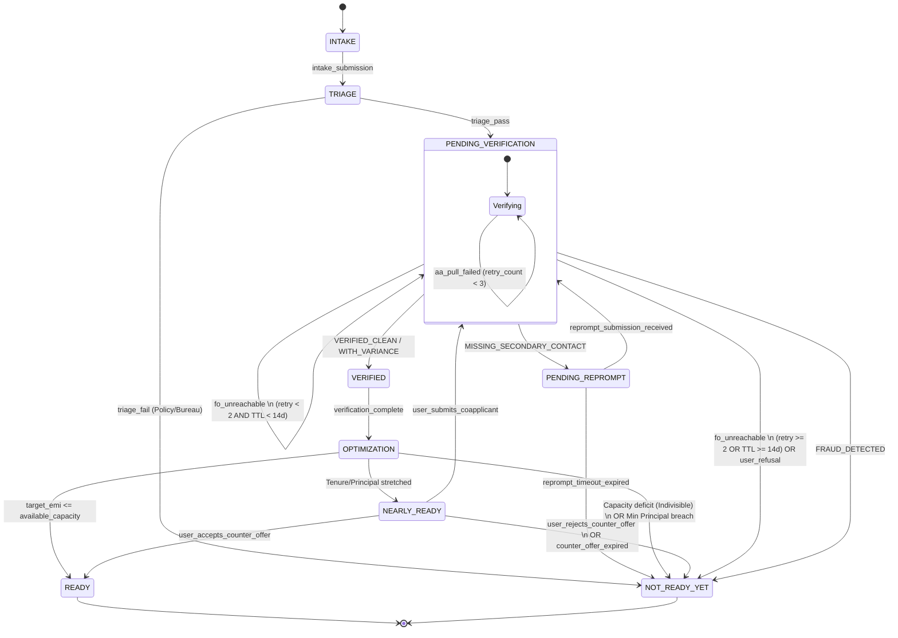

# RiskIntel V2 State Machine

This graph unifies the Phase 1 base machine with the recovery loops, physical fallbacks, and re-prompt mechanisms defined in ADRs 023, 025, and 029.

```mermaid
stateDiagram-v2
    [*] --> INTAKE

    INTAKE --> TRIAGE : intake_submission
    
    TRIAGE --> PENDING_VERIFICATION : triage_pass
    TRIAGE --> NOT_READY_YET : triage_fail (Policy/Bureau)

    %% VERIFICATION CORE
    state PENDING_VERIFICATION {
        [*] --> Verifying
        Verifying --> Verifying : aa_pull_failed (retry_count < 3)
    }

    %% FALLBACK AND REPROMPT LOOPS
    PENDING_VERIFICATION --> PENDING_VERIFICATION : aa_pull_failed (retry >= 3) \n [Mutate to FO]
    PENDING_VERIFICATION --> PENDING_VERIFICATION : aa_pull_empty \n [Mutate to FO]
    
    PENDING_VERIFICATION --> PENDING_VERIFICATION : fo_unreachable \n (retry < 2 AND TTL < 14d)
    PENDING_VERIFICATION --> NOT_READY_YET : fo_unreachable \n (retry >= 2 OR TTL >= 14d) OR user_refusal

    PENDING_VERIFICATION --> PENDING_REPROMPT : MISSING_SECONDARY_CONTACT
    PENDING_REPROMPT --> PENDING_VERIFICATION : reprompt_submission_received
    PENDING_REPROMPT --> NOT_READY_YET : reprompt_timeout_expired

    PENDING_VERIFICATION --> NOT_READY_YET : FRAUD_DETECTED

    %% SUCCESSFUL VERIFICATION TO OPTIMIZATION
    PENDING_VERIFICATION --> VERIFIED : VERIFIED_CLEAN / WITH_VARIANCE
    VERIFIED --> OPTIMIZATION : verification_complete
    
    %% OPTIMIZATION AND RECOVERY
    OPTIMIZATION --> READY : target_emi <= available_capacity
    OPTIMIZATION --> NOT_READY_YET : Capacity deficit (Indivisible) \n OR Min Principal breach
    OPTIMIZATION --> NEARLY_READY : Tenure/Principal stretched
    
    NEARLY_READY --> PENDING_VERIFICATION : user_submits_coapplicant
    NEARLY_READY --> READY : user_accepts_counter_offer
    NEARLY_READY --> NOT_READY_YET : user_rejects_counter_offer \n OR counter_offer_expired

    READY --> [*]
    NOT_READY_YET --> [*]
```
