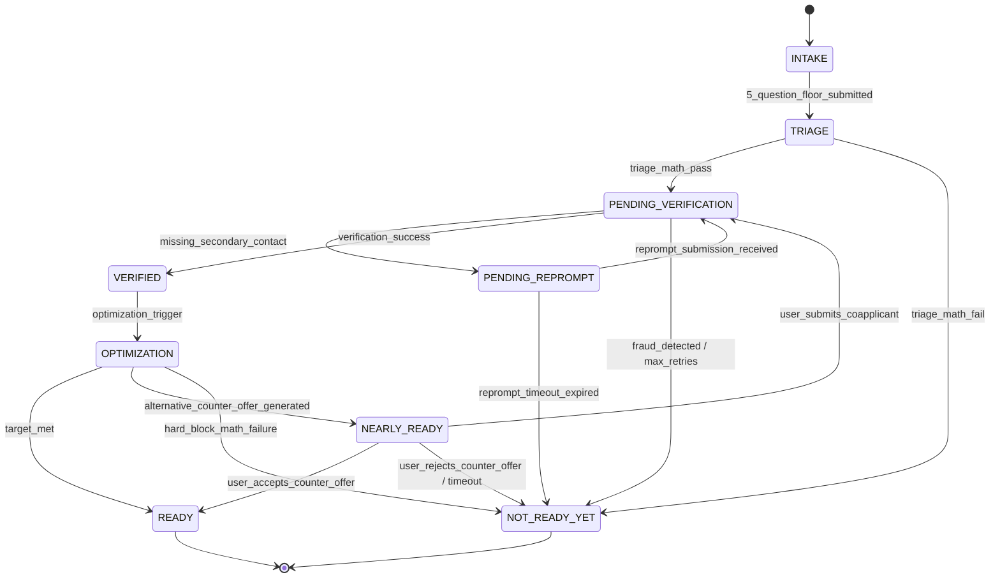

# RiskIntel V2: Application Flow (State Machine)

## 1. Global State DAG
*Source: `STATE_MACHINE.md`, `ADR-023`, `ADR-025`*

## 2. Recovery Loops (The Cyclic Exceptions)
The architecture explicitly bans loops to prevent infinite logic execution, with exactly two mathematically bounded exceptions:

1.  **The Re-Prompt Loop (`PENDING_REPROMPT` -> `PENDING_VERIFICATION`):** Solves field officer omissions without failing the borrower. Bounded by a strict TTL timeout.
2.  **The Co-Applicant Loop (`NEARLY_READY` -> `PENDING_VERIFICATION`):** Allows a failed Primary Applicant to append household income and restart the verification freeze. Bounded by state constraints.
