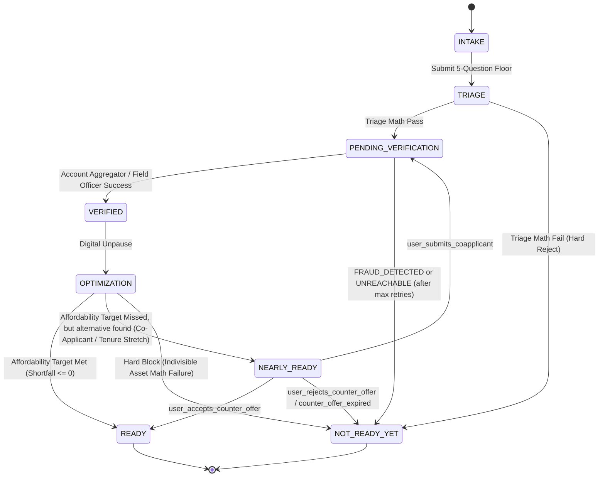

# RiskIntel V2 State Machine

This document defines the complete end-to-end lifecycle of a loan application in the RiskIntel V2 system. The state machine strictly enforces the "Verification Freeze," ensuring no unverified optimization can occur.

---

## 1. Required States

1.  `INTAKE`
2.  `TRIAGE`
3.  `NOT_READY_YET`
4.  `PENDING_VERIFICATION`
5.  `VERIFIED`
6.  `OPTIMIZATION`
7.  `NEARLY_READY`
8.  `READY`

---

## 2. State Transition Diagram

---

## 3. State Definitions

### 3.1 INTAKE
*   **Description:** The user is filling out the 5-Question Floor.
*   **Entry Conditions:** New application initiated.
*   **Exit Conditions:** User submits the PAN/Aadhaar and income bracket.
*   **Transitions:** -> `TRIAGE`

### 3.2 TRIAGE
*   **Description:** The internal CPU evaluates the absolute best-case scenario using the upper bound of the declared income bracket and max tenure. 
*   **Entry Conditions:** Intake data submitted.
*   **Transitions:**
    *   `PENDING_VERIFICATION`: If `Triage_Capacity` >= `Minimum_Product_EMI` and Bureau CIBIL >= 650 (or Thin File).
    *   `NOT_READY_YET`: If `Triage_Capacity` < `Minimum_Product_EMI`, or Bureau hits a terminal failure (DPD > 0, CIBIL < 650). CIBIL < 650 triggers a coaching path to add a Co-Applicant with CIBIL ≥ 650.

### 3.3 PENDING_VERIFICATION
*   **Description:** Optimization is strictly frozen. The system waits for physical or digital truth.
*   **Entry Conditions:** Passed Triage.
*   **Transitions:**
    *   `VERIFIED`: Account Aggregator payload received OR Field Officer completes physical visit with `VERIFIED_CLEAN` / `VERIFIED_WITH_VARIANCE`.
    *   `NOT_READY_YET`: Applicant refuses verification, FO returns `FRAUD_DETECTED`, or applicant is `UNREACHABLE` after 14-day max retry window (2 attempts).

### 3.4 VERIFIED
*   **Description:** A transient, internal system state where categorical intake brackets are permanently destroyed and replaced by exact deterministic integers.
*   **Entry Conditions:** Verification payload mathematically processed.
*   **Transitions:** -> `OPTIMIZATION` (Auto-trigger).

### 3.5 OPTIMIZATION
*   **Description:** The deterministic engine calculates the exact `Available Capacity` and slides `Tenure` (and `Loan Amount` if Divisible) to find an approval path.
*   **Entry Conditions:** Automatically follows `VERIFIED`.
*   **Transitions:**
    *   `READY`: `EMI_Shortfall` <= 0 on requested terms.
    *   `NEARLY_READY`: Requested terms fail, but an alternative exists (e.g., Max Tenure stretched, or Co-Applicant Income requirement generated).
    *   `NOT_READY_YET`: Indivisible asset (Loan Amount locked), Max Tenure reached, and shortfall is mathematically impossible to bridge.

### 3.6 READY
*   **Description:** Final approved state on the borrower's exact requested terms.
*   **Coaching Output:** Celebration UI and immediate disbursement roadmap.

### 3.7 NEARLY_READY
*   **Description:** The borrower is approved, but strictly on an alternative counter-offer mathematically designed to prevent default.
*   **Coaching Output:** Interactive slider UI. Displays the required Co-Applicant Baseline Income or the newly stretched Tenure.
*   **Exit Conditions (Recovery Loop):**
    *   `PENDING_VERIFICATION`: Event `user_submits_coapplicant` occurs (ingests via `intake_submission` and loops back to verification).
    *   `READY`: Event `user_accepts_counter_offer` occurs (borrrower agrees to reduced amount or stretched tenure).
    *   `NOT_READY_YET`: Event `user_rejects_counter_offer` occurs, or `counter_offer_expired` (TTL elapsed).

### 3.8 NOT_READY_YET
*   **Description:** Terminal failure state due to an Immutable Constraint (Trust, Resilience, Affordability, or Fraud).
*   **Coaching Output:** Explanatory recovery roadmap explicitly detailing the exact failure point (e.g., "Your business vintage is only 8 months; please re-apply in 4 months.").
