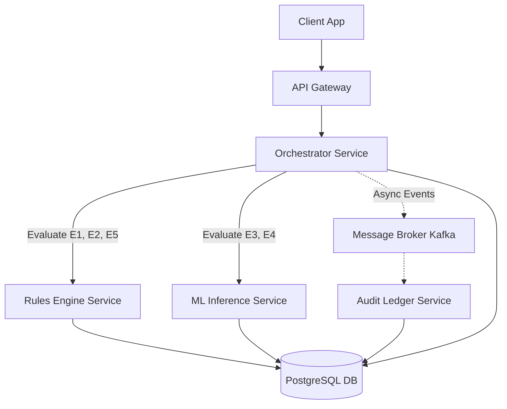
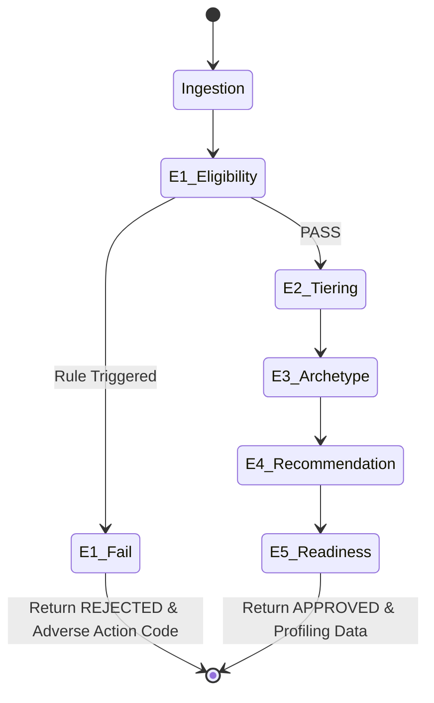
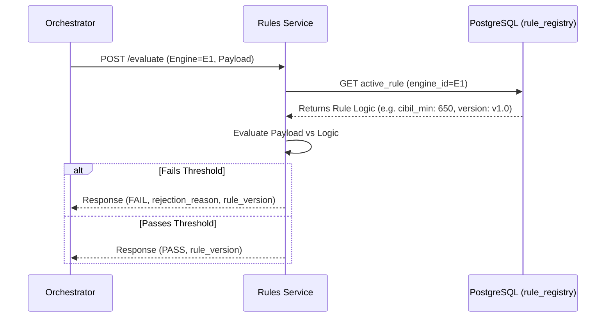
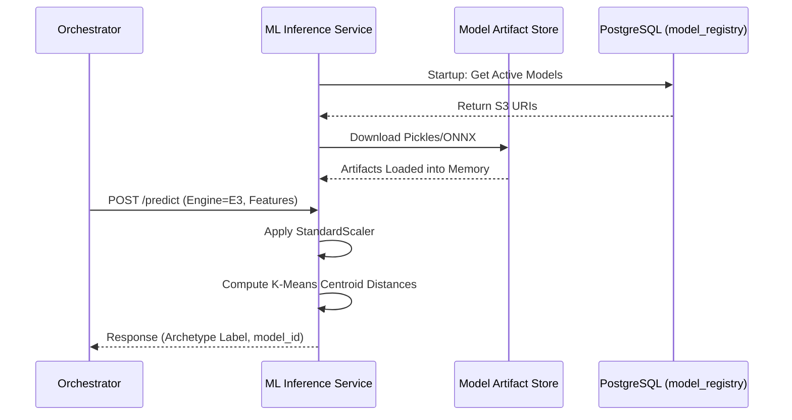
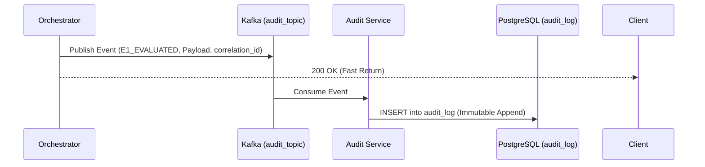
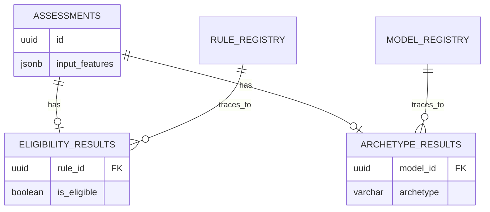

# RiskIntel Backend System Architecture Specification

**Role:** Principal Systems Architect  
**Status:** FROZEN (Final Specification)  

---

## 1. Architecture Overview
RiskIntel is a financial decision-support system deployed as a suite of decoupled microservices. The architecture enforces a strict bifurcation between **Regulatory Gating** (Deterministic Rules) and **Strategic Profiling** (Machine Learning). This ensures 100% explainability for adverse actions (FCRA/ECOA compliance) while safely operationalizing advanced ML clustering for approved applicants.

*   **E1 (Eligibility):** Rule Engine
*   **E2 (Tiering):** Rule Engine
*   **E3 (Archetypes):** ML Engine (K-Means)
*   **E4 (Recommendation):** ML/Hybrid Engine
*   **E5 (Readiness):** Rule Engine

---

## 2. Service Boundaries
The backend is divided into five core microservices:

1.  **API Gateway:** Handles JWT authentication, rate limiting, and request routing.
2.  **Orchestrator Service:** Manages the execution Directed Acyclic Graph (DAG). Maintains assessment state.
3.  **Rules Engine Service:** High-throughput, stateless Go/Rust service evaluating deterministic rules from the Rule Registry.
4.  **ML Inference Service:** Python (FastAPI) service loading serialized Pickles/ONNX models into memory to compute non-linear projections.
5.  **Audit Ledger Service:** Asynchronous consumer pulling events from Kafka and writing immutable compliance logs to PostgreSQL.

---

## 3. Orchestrator Flow (Request Lifecycle)
The Orchestrator manages the DAG. If an applicant fails a deterministic gate (E1), the DAG immediately halts, returning a rejection (Person B Flow). If they pass, the DAG completes the ML profiling (Person A Flow).

---

## 4. Rule Engine Flow
The Rules Engine Service is completely stateless. It fetches the active configuration for the requested rule and evaluates the applicant payload against it.

---

## 5. ML Inference Flow
The ML Inference Service requires strict lineage tracking. Models are version-controlled in an S3 registry.

---

## 6. Audit Flow
Compliance mandates an immutable ledger. The Orchestrator does not write audit logs synchronously. It publishes events to Kafka, ensuring the API response remains low-latency while guaranteeing eventual consistency in the audit log.

---

## 7. Database Flow
The database enforces Referential Integrity between the `assessments` (the applicant request) and the `registry` (the rules/models used).

---

## 8. Health Check Architecture
Kubernetes requires specialized health endpoints to manage routing and pod lifecycles safely.

*   `GET /v1/health/live`: Simple `200 OK`. If this fails, K8s kills and restarts the pod.
*   `GET /v1/health/ready`: Checks DB/Redis connection. If this fails, K8s stops routing traffic to the pod but does not kill it.
*   `GET /v1/health/deep`: Iterates through the `model_registry` and validates that all models marked `active` in the database are successfully loaded in RAM. Used for Datadog/Prometheus monitoring.

---

## 9. Security Architecture
*   **Authentication:** The API Gateway validates JWTs issued by the Identity Provider (e.g., Auth0/Okta).
*   **PII Hashing:** Applicant Tax IDs (SSN/PAN) are never stored in plaintext. They are salted and hashed via SHA-256 (`tax_id_hash`) at the API Gateway. This allows for duplicate application detection without exposing raw identity vectors.
*   **Data at Rest/Transit:** All PostgreSQL volumes use AES-256 encryption at rest. Internal service-to-service communication occurs over mTLS (mutual TLS) managed by a service mesh (e.g., Istio).

---

## 10. Deployment Architecture
*   **Infrastructure:** Kubernetes (EKS/GKE).
*   **Compute Profiles:**
    *   *Rules Service Pods:* High CPU, Low Memory, horizontally scaled aggressively.
    *   *ML Inference Pods:* Moderate CPU, High Memory (caching large matrices), scaled based on custom metrics (e.g., inference queue length).
*   **CI/CD Pipeline (ML Gate):**
    *   Pushing a new model to the Registry triggers an automated UMAP topology pipeline in Jenkins/GitHub Actions.
    *   If the Local Neighborhood Homogeneity score drops below `0.90`, the pipeline automatically fails, blocking the degraded model from production deployment.
