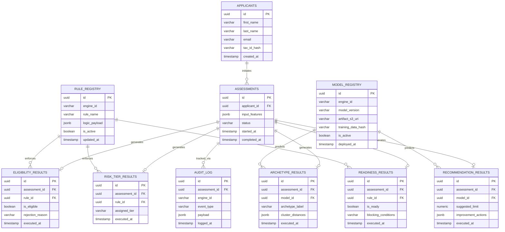

# RiskIntel Production Database Architecture

**Role:** Principal Backend Architect  
**Status:** Implementation-Ready Specification  

## 1. Overview
This specification details the production relational database schema for the RiskIntel platform. It is designed to ensure strict compliance with the Fair Credit Reporting Act (FCRA) and the Equal Credit Opportunity Act (ECOA) by enforcing perfect audit reconstruction and model lineage traceability. The schema naturally accommodates the platform's hybrid architecture of Deterministic Rule Engines (E1, E2, E5) and Machine Learning models (E3, E4).

---

## 2. Entity Relationship Diagram

---

## 3. Schema Definitions

### 3.1. `applicants`
*   **Purpose:** Stores core PII and identity resolution data for the individual requesting the assessment.
*   **Columns & Data Types:**
    *   `id` (UUID, Primary Key)
    *   `first_name` (VARCHAR)
    *   `last_name` (VARCHAR)
    *   `email` (VARCHAR, UNIQUE)
    *   `tax_id_hash` (VARCHAR) - *Salted hash of SSN/PAN for deduplication without storing plaintext.*
    *   `created_at` (TIMESTAMP WITH TIME ZONE)
*   **Indexing Strategy:** B-Tree index on `email` and `tax_id_hash` for fast identity resolution.

### 3.2. `assessments`
*   **Purpose:** Represents a single run of the RiskIntel pipeline for an applicant.
*   **Columns & Data Types:**
    *   `id` (UUID, Primary Key)
    *   `applicant_id` (UUID, Foreign Key -> `applicants.id`)
    *   `input_features` (JSONB) - *Snapshot of the exact data payload sent by the applicant.*
    *   `status` (VARCHAR) - *E.g., PENDING, REJECTED, COMPLETED.*
    *   `started_at` (TIMESTAMP WITH TIME ZONE)
    *   `completed_at` (TIMESTAMP WITH TIME ZONE)
*   **Indexing Strategy:** Index on `applicant_id`. GIN index on `input_features` to query across historical financial profiles.

### 3.3. `eligibility_results` (E1 - Rule Engine)
*   **Purpose:** Stores the outcome of the deterministic E1 gating mechanism.
*   **Columns & Data Types:**
    *   `id` (UUID, Primary Key)
    *   `assessment_id` (UUID, Foreign Key -> `assessments.id`, UNIQUE)
    *   `rule_id` (UUID, Foreign Key -> `rule_registry.id`)
    *   `is_eligible` (BOOLEAN)
    *   `rejection_reason` (VARCHAR) - *Maps directly to Adverse Action code.*
    *   `executed_at` (TIMESTAMP WITH TIME ZONE)
*   **Indexing Strategy:** Index on `assessment_id`.

### 3.4. `risk_tier_results` (E2 - Rule Engine)
*   **Purpose:** Stores the assigned risk tier (e.g., P1-P4).
*   **Columns & Data Types:**
    *   `id` (UUID, Primary Key)
    *   `assessment_id` (UUID, Foreign Key -> `assessments.id`, UNIQUE)
    *   `rule_id` (UUID, Foreign Key -> `rule_registry.id`)
    *   `assigned_tier` (VARCHAR)
    *   `executed_at` (TIMESTAMP WITH TIME ZONE)
*   **Indexing Strategy:** Index on `assessment_id` and `assigned_tier`.

### 3.5. `archetype_results` (E3 - ML Engine)
*   **Purpose:** Stores the K-Means clustering output.
*   **Columns & Data Types:**
    *   `id` (UUID, Primary Key)
    *   `assessment_id` (UUID, Foreign Key -> `assessments.id`, UNIQUE)
    *   `model_id` (UUID, Foreign Key -> `model_registry.id`)
    *   `archetype_label` (VARCHAR)
    *   `cluster_distances` (JSONB) - *Stores distance to all centroids to measure prediction confidence.*
    *   `executed_at` (TIMESTAMP WITH TIME ZONE)
*   **Indexing Strategy:** Index on `assessment_id`.

### 3.6. `recommendation_results` (E4 - Engine)
*   **Purpose:** Stores personalized limit and rate recommendations.
*   **Columns & Data Types:**
    *   `id` (UUID, Primary Key)
    *   `assessment_id` (UUID, Foreign Key -> `assessments.id`, UNIQUE)
    *   `model_id` (UUID, Foreign Key -> `model_registry.id`) - *Nullable if rules-based fallback is used.*
    *   `suggested_limit` (NUMERIC)
    *   `improvement_actions` (JSONB)
    *   `executed_at` (TIMESTAMP WITH TIME ZONE)
*   **Indexing Strategy:** Index on `assessment_id`.

### 3.7. `readiness_results` (E5 - Rule Engine)
*   **Purpose:** Stores final readiness flags (e.g., KYC checks, document verification).
*   **Columns & Data Types:**
    *   `id` (UUID, Primary Key)
    *   `assessment_id` (UUID, Foreign Key -> `assessments.id`, UNIQUE)
    *   `rule_id` (UUID, Foreign Key -> `rule_registry.id`)
    *   `is_ready` (BOOLEAN)
    *   `blocking_conditions` (VARCHAR)
    *   `executed_at` (TIMESTAMP WITH TIME ZONE)
*   **Indexing Strategy:** Index on `assessment_id`.

### 3.8. `audit_log`
*   **Purpose:** Immutable, append-only ledger of every step in the Orchestrator DAG.
*   **Columns & Data Types:**
    *   `id` (UUID, Primary Key)
    *   `assessment_id` (UUID, Foreign Key -> `assessments.id`)
    *   `engine_id` (VARCHAR) - *E.g., "E1", "E3"*
    *   `event_type` (VARCHAR) - *E.g., "EXECUTION_STARTED", "EXECUTION_FAILED"*
    *   `payload` (JSONB) - *Raw input/output state of the specific engine.*
    *   `logged_at` (TIMESTAMP WITH TIME ZONE DEFAULT CURRENT_TIMESTAMP)
*   **Indexing Strategy:** Index on `assessment_id` and `logged_at` for rapid temporal reconstruction. This table must be partitionable by month/year.

### 3.9. `model_registry`
*   **Purpose:** Tracks versions of E3 and E4 ML models to guarantee exactly which weights made which prediction.
*   **Columns & Data Types:**
    *   `id` (UUID, Primary Key)
    *   `engine_id` (VARCHAR) - *E.g., "E3"*
    *   `model_version` (VARCHAR) - *Semantic versioning (e.g., "1.2.0")*
    *   `artifact_s3_uri` (VARCHAR) - *Pointer to the physical Pickle/ONNX file.*
    *   `training_data_hash` (VARCHAR) - *SHA-256 hash of the dataset used to train this model version.*
    *   `is_active` (BOOLEAN)
    *   `deployed_at` (TIMESTAMP WITH TIME ZONE)
*   **Indexing Strategy:** Partial index on `engine_id` where `is_active = true`.

### 3.10. `rule_registry`
*   **Purpose:** Tracks the exact versions of the deterministic rule logic for E1, E2, E5.
*   **Columns & Data Types:**
    *   `id` (UUID, Primary Key)
    *   `engine_id` (VARCHAR)
    *   `rule_name` (VARCHAR)
    *   `logic_payload` (JSONB) - *The exact thresholds/logic (e.g., `{"cibil_min": 650}`).*
    *   `is_active` (BOOLEAN)
    *   `updated_at` (TIMESTAMP WITH TIME ZONE)
*   **Indexing Strategy:** Partial index on `engine_id` where `is_active = true`.

---

## 4. Operational Flows

### Data Lineage Flow
1.  Applicant submits application (`applicants` updated).
2.  Orchestrator spawns an assessment, storing the exact API payload in `assessments.input_features`.
3.  As each engine fires, the specific module queries the active rule/model from `rule_registry` or `model_registry`.
4.  The engine computes the output and writes to its specific result table (`eligibility_results`, `archetype_results`, etc.), strictly embedding the `rule_id` or `model_id` used for that computation.

### Audit Traceability Flow (FCRA / ECOA Compliance)
If an applicant challenges a rejection (e.g., E1 FAIL):
1.  Compliance officer queries `assessments` for the application ID.
2.  Retrieves the immutable snapshot of `assessments.input_features` at the exact time of application.
3.  Queries `eligibility_results` to find the specific `rule_id` that triggered the rejection.
4.  Queries `rule_registry` using that `rule_id` to retrieve the exact logic (e.g., `cibil_min: 650`) active at that millisecond.
5.  Queries the `audit_log` to prove there were no system failures or orchestration errors during the execution.

If regulators demand an ML audit (e.g., E3 Archetype bias):
1.  Regulator queries `archetype_results` for the historical cohort.
2.  Extracts the `model_id` for those predictions.
3.  Queries `model_registry` to retrieve the exact `training_data_hash` and `artifact_s3_uri`.
4.  Risk teams pull the specific dataset hash and recreate the exact model topology to prove non-discriminatory boundaries.
